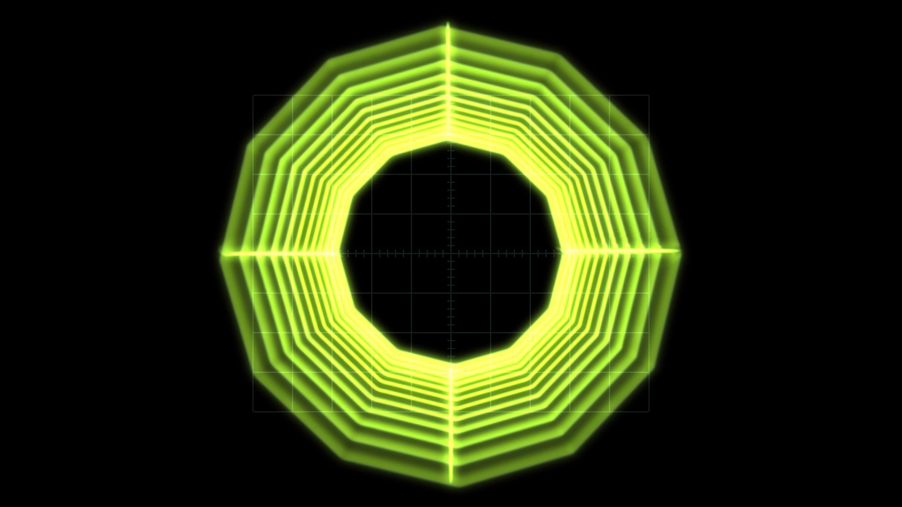

# Vectrix user guide

Vectrix is **an oscillator, a pedalboard and a cathode ray tube in X/Y mode**, as two plugins for
Resolume Arena and Avenue — and again as an OpenFX bundle for Resolve, Vegas, Nuke and Natron.

A function generator makes a two-channel signal. That signal goes through fourteen guitar and
eurorack effects — a gate, a compressor, a wavefolder, a ring modulator, a phaser, a delay, a
spring-ish reverb — and what comes out the far end drives the horizontal and vertical deflection
of a scope. **You are not watching a picture of an oscilloscope. You are watching where the beam
went.**



> **Before you rely on this:** the central claim — that brightness follows dwell time — is measured
> rather than asserted. One sweep is rendered at ten speeds spanning a hundred to one, and the test
> fails if the total light deposited varies by more than half a per cent; a second regresses the
> measured line density against `1/v`. Both probe the same shader code that ships, and a control
> sweep fails if any parameter turns out to do nothing.
>
> **Both plugins have been loaded and run in Resolume Arena.** What is still unconfirmed is
> narrower: whether Arena's input is genuinely premultiplied, and how the Trace source's readback
> behaves for frame rate in a real host.
>
> This codebase was created with AI assistance, directed and reviewed by a human author.

Inspired by [Ms Mad Lemon](https://www.youtube.com/@MsMadLemon)'s *Vector Synth Visualizer*
series, which does the same thing with 555 timers, LM358 op-amps and the deflection yoke of a CRT
television.

---

## Two plugins

- **Vectrix** (a source) generates its own signal over its own tube.
- **Vectrix Trace** (an effect) paints the clip below **on the tube face**, so it curves with the
  glass, sits behind the graticule and shares the halation. It can also take that clip *as* the
  signal, tracing its edges with the beam.

Both declare the same parameters, so a composition can be moved between them.

---

## Start from a preset

There are about a hundred and fifty controls in sixteen groups. That is a lot, and cutting them is
not the answer, because **the effect parameters *are* the plugin**.

**Each preset is a whole machine rather than a set of slider positions**, so turning one knob on it
does something you can predict. Start there and go outward.

---

## Why brightness follows dwell time

This models a route, not a look. Every artefact is a consequence of one fact.

The beam deposits light at a constant rate while it is on. Where it moves fast it spreads that
light over a long distance and the trace is dim; where it turns around it lingers, and the trace
blooms. **That is why a square drawn by an oscilloscope has bright corners and a square drawn by a
computer does not.**

The renderer never computes `1/v`. It deposits a fixed quantum of energy per sample interval and
spreads it over the distance the beam actually covered, and the `1/v` falls out — along with the
correct behaviour at both extremes and no clamps anywhere: a beam crossing the screen in one step
is faint, and a beam standing still is bright but finite, because the energy is conserved either
way.

Everything else follows the same rule, and it is worth knowing because it tells you what to expect:

- The **delay**'s repeats get rounder, because its feedback path is low-passed and a low-passed
  deflection signal has softer corners.
- The **gate** darkens the trace without moving it, because a grid voltage cuts beam current
  without touching the yoke.
- **Sample & Hold** draws lines between its steps, because the beam travels rather than
  teleporting.
- **Blank on Retrace** with two sawtooths gives a clean raster, because the beam is genuinely cut
  off during flyback — not because anything declined to draw the flyback line.

---

## Sources

**Oscillator** — sine, triangle, saw, ramp, pulse, noise and sample & hold per axis, with the X:Y
ratio **locked to exact rationals** so a Lissajous figure stands still. Detune is a separate
control, for when you want the drift.

**Shape** — circle, square, diamond, polygon, star, rose, spirograph.

**Wireframe** — a spinning cube, a globe, a tunnel, and a scrolling three-dimensional landscape
with hidden-line removal.

**Audio file** — WAV, AIFF, MP3, FLAC, Ogg and Opus. Left drives X, right drives Y. This is how
[oscilloscope music](https://oscilloscopemusic.com) works, and Vectrix plays it. Mono files get a
delayed-self plot rather than a flat line.

**Trace** (effect only) — finds the edges of the clip below and walks them with the beam. **Honest
expectation: excellent on titles, logos, graphics and line art; a scribble on real footage.** That
is a property of the problem, not a setting to find.

---

## The pedalboard

Fixed order, because fourteen blocks is fourteen factorial orderings and "what order are my pedals
in" is the first thing anyone gets wrong:

```
VCA → Gate → Compressor → Rectifier → Slew → Drive/Fold → Ring Mod → Bitcrush
    → Phaser → Flanger → Chorus → Delay → Reverb → Deflection Amp
```

Each block can process **both axes, one axis, or the mid/side pair** — and that routing control is
where most of the pictures come from, because an effect applied to one deflection axis and not the
other is not a filter, it is a geometric transform.

Three worth going to first:

**Phaser** is the one that justifies doing any of this on the CPU. On X only it shifts each
frequency component of the horizontal deflection by a different amount, so a sine figure *rotates*
and a complex one *shears*. That is not an affine transform, so no shader can produce it. At Mix
1.0 there are no notches at all and it becomes a pure rotator.

**Compressor** pumps the figure's *size*. It is the single best block for making a static figure
feel alive, and it is what makes the audio-file source usable at all, since scope music has wildly
varying level. Its limiter offers **Gain** (the figure shrinks) or **Rail** (the figure flattens
against the edge of the screen, exactly as a deflection amplifier does when it runs out of
headroom).

**Slew limiter** rounds every corner, and turns Sample & Hold from a constellation into a
constellation with strings.

---

## The tube

The phosphors are a **measured table, not a tint**.

**P31** is the modern scope green, and at true persistence it shows no trail at all at 60 fps —
because that is what P31 *is*, and why nobody photographs slow sweeps on one. **P7** is the
two-layer cascade: a blue flash that pumps a yellow-green layer underneath, so the trail is a
different colour from the strike.

**Switching phosphor changes the brightness by up to three times**, because the efficiencies are
real. That is not a bug to compensate for with the master level.

**Face Aspect**, **Corner Radius** and **Deflection Gain** span both references without a second
renderer: the defaults are a round lab scope, and 4:3 with a small corner radius and a little
overscan gives the consumer television.

**Cost:** the face buffer is sized by the *spot*, not by the output, so 4K costs about two and a
half times 1080p rather than four. The real cost driver is **Focus** — a sharper tube genuinely
resolves more and genuinely costs more.

---

## In OpenFX hosts

Copy `Vectrix.ofx.bundle` to `/Library/OFX/Plugins` (macOS),
`C:\Program Files\Common Files\OFX\Plugins` (Windows) or `/usr/OFX/Plugins`
(Linux).

> **On Linux, install GLEW first or the plugin will not load.** Vectrix's trace
> renderer is on the GPU, so unlike its siblings this `.ofx` links OpenGL and needs
> `libGLEW.so.2.0` at run time. On Rocky 8 / RHEL 8: `sudo dnf config-manager
> --set-enabled powertools && sudo dnf install glew-devel`. An OFX host does not
> report a plugin that fails to load, so without it Resolve simply starts with no
> Vectrix and no error.

The signal chain is the same code — the engine
is linked in, not reimplemented — but four things genuinely differ, and they are limitations rather
than choices:

- **It renders on the CPU.** OpenFX hands a plugin no GL context, so the beam, the phosphor and the
  glass are a mirror of the GLSL rather than the GLSL. Offline-render speed, not interactive.
- **It replays.** Vectrix is stateful — phosphor, delay lines, a reverb tank — and OpenFX renders
  frames in whatever order it likes. A seek, a jump or a parameter edit restarts the chain and
  warms it up over 120 frames. A linear render is exact; a reverb tail longer than that window is
  not.
- **No tempo and no audio.** OpenFX has neither, so the tempo is pinned at 120 and the spectrum
  reads as silence. The LFOs still run, since they need only a frame duration, so the modulation
  slots are live.
- **The Trace source draws no beam**, because its edge pass needs a GPU. You get the tube, the
  graticule and the clip on the glass, with the gun cut off.

---

## If it looks wrong

**The figure drifts instead of standing still.** Detune is not at zero. The X:Y ratio is locked to
exact rationals precisely so it *can* stand still.

**Everything got much darker when I changed phosphor.** Correct — the efficiencies are real, and
P31 against P7 is up to a factor of three.

**Trace on real footage is a scribble.** Expected. Use it on titles, logos and line art.

**No trail at all on P31.** Also correct, and the reason P7 exists.

**The effect does nothing.** That is what a shader that would not compile looks like from outside.
Check `~/Library/Logs/vectrix/`.
